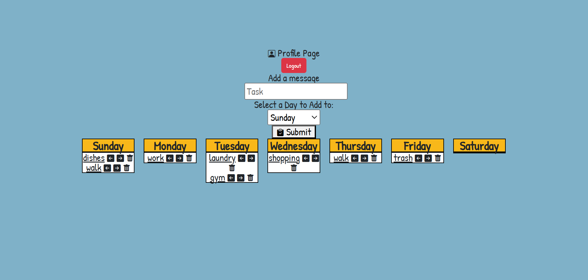

# Weekly To Do List App

Link to project: (https://weeklytodolist.onrender.com/)

## How It's Made:
Tech used: EJS, CSS, JavaScript, Node.js, Passport.js, MongoDB

This application is a task management system where users can add, update, and delete tasks, as well as move tasks between days of the week. It uses Node.js and Express.js for server-side logic. EJS templates handle front-end rendering, and MongoDB stores tasks and user data. Passport.js manages user authentication, with routes for login, signup, and logout.

## Key Features:
- Dynamic Task Scheduling: Tasks can be assigned to specific days and moved left or right in the week using helper functions.
- Authentication: Users must log in to access and manage their tasks.
- CRUD Operations: Users can create, update, and delete tasks, ensuring full control over their task list.

## Optimizations:
- Day Transition Functions: The moveLeft and moveRight functions use switch cases for readability and easy addition of custom logic.
- Secure Task Handling: Each task is linked to the authenticated user, preventing unauthorized access or manipulation.
- Seamless UI Integration: Tasks are dynamically rendered on the profile page, enhancing the user experience.

## Lessons Learned:
- Task Context Tracking: Managing tasks across different days of the week highlights the importance of robust state tracking and error handling.
- Improved Maintainability: Using helper functions like moveLeft and moveRight simplifies logic for task movement and makes the codebase modular.
- Security in Multi-User Systems: Linking tasks directly to users ensures data isolation and reduces potential security risks.

## Installation

1. Clone repo
2. run `npm install`

## Usage

1. run `node server.js`
2. Navigate to `localhost:8080`

## Credit

Modified from Scotch.io's auth tutorial
